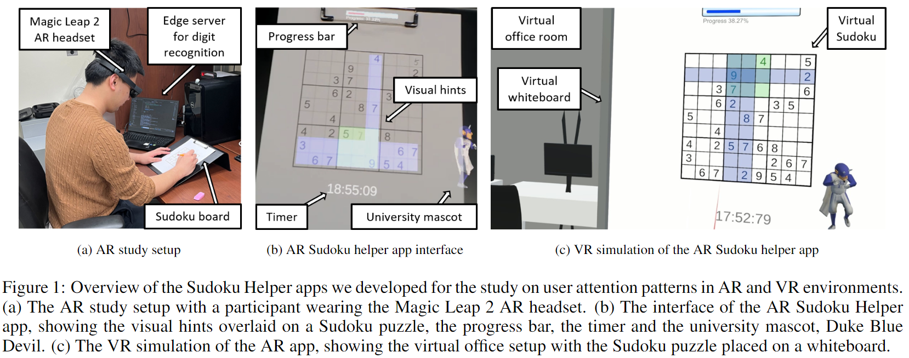

# Attention-Patterns-in-Extended-Reality
This is the official code repo for our ISMAR '24 paper, *"Looking" into Attention Patterns in Extended Reality: An Eye Tracking-Based Study* by Zhehan Qu, Ryleigh Byrne and [Maria Gorlatova](https://maria.gorlatova.com/current-research/). The Arxiv version of the paper can be found [here](temp). The overview of our study is shown in Figure 1.


If you are interested, please also check out the video demos of our AR and VR apps (click on the images to go to YouTube).

### AR Demo Video
[](https://www.youtube.com/watch?v=KJo9mlpy4hQ)

### VR Demo Video
[](https://www.youtube.com/watch?v=pSNMBX7PYPw)


Please refer to the individual READMEs at [first order analysis](gaze_data_analysis/README.md), [machine learning](mvts_transformer/README_Sudoku.md) and [sudoku_hint_generator](sudoku_hint_generator/README.md) for code descriptions. Note that for each sub-component there's a separate `requirements.txt`. Unfortunately, due to our IRB protocol we cannot release the eye gaze data we collected. Sample data are provided in [dataset](dataset) to show the format. 

If you find this code or any idea in the paper useful, please consider citing:
```
@INPROCEEDINGS{qu2024looking,
  author={Qu, Zhehan and Byrne, Ryleigh and Gorlatova, Maria},
  booktitle={Proceedings of IEEE ISMAR}, 
  title={``Looking'' into Attention Patterns in Extended Reality: An Eye Tracking--Based Study}, 
  year={2024},
}
```