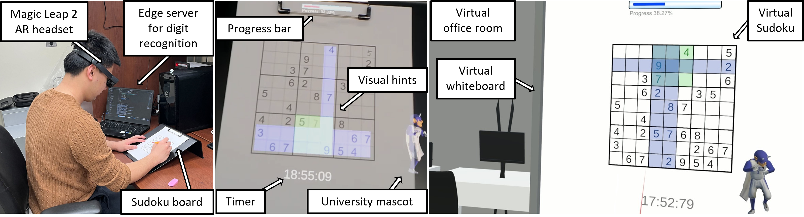

# Attention-Patterns-in-Extended-Reality
This is the official code repo for our IEEE ISMAR '24 paper, *"Looking" into Attention Patterns in Extended Reality: An Eye Tracking-Based Study* by Zhehan Qu, Ryleigh Byrne and [Maria Gorlatova](https://maria.gorlatova.com/current-research/). You can find the paper [here](https://ieeexplore.ieee.org/document/10765374) on IEEE website or [here](https://maria.gorlatova.com/wp-content/uploads/2024/08/Qu2024Looking.pdf) on our lab publication list. 

## Overview

In this work we developed two Sudoku Helper apps in AR and VR that assist the user to solve a Sudoku puzzle by overlaying hints on top of it. Additionally, we added a distractor in the form of a dancing Duke Blue Devil to investigate how the users' gaze behavior corresponds to (1) the modality, i.e. whether it is AR or VR and (2) the presence of distraction. Through a user study with 38 users in total, we identified that VR induced higher perceptual load and decreased user focus, while cognitive load increased in AR. With the data collected we also trained ML models to predict the existence of distractors and user attention control ability, showing performance drops when transferring between AR and VR, validating the gap between the two.

If you are interested, please also check out the video demos of our AR and VR apps (click on the images to go to YouTube).

---
### AR Demo Video
[](https://www.youtube.com/watch?v=KJo9mlpy4hQ)

### VR Demo Video
[](https://www.youtube.com/watch?v=pSNMBX7PYPw)


Please refer to the individual READMEs at [first order analysis](gaze_data_analysis/README.md), [machine learning](mvts_transformer/README_Sudoku.md) and [sudoku_hint_generator](sudoku_hint_generator/README.md) for code descriptions. Note that for each sub-component there's a separate `requirements.txt`. Unfortunately, due to our IRB protocol we cannot release the eye gaze data we collected. Sample data are provided in [dataset](dataset) to show the format. 

## Citation
If you find this code or any idea in the paper useful, please consider citing:
```
@INPROCEEDINGS{qu2024looking,
  author={Qu, Zhehan and Byrne, Ryleigh and Gorlatova, Maria},
  booktitle={Proceedings of IEEE ISMAR}, 
  title={``Looking'' into Attention Patterns in Extended Reality: An Eye Tracking--Based Study}, 
  year={2024},
}
```

## Acknowledgments
We thank Prof. David Carlson for helpful discussions regarding the work and all participants for contributing to the study. This work was supported in part by NSF grants CSR-2312760, CNS-2112562, and IIS-2231975, NSF CAREER Award IIS-2046072, NSF NAIAD Award 2332744, a Cisco Research Award, a Meta Research Award, Defense Advanced Research Projects Agency Young Faculty Award HR0011-24-1-0001, and the Army Research Laboratory under Cooperative Agreement Number W911NF-23-2-0224.